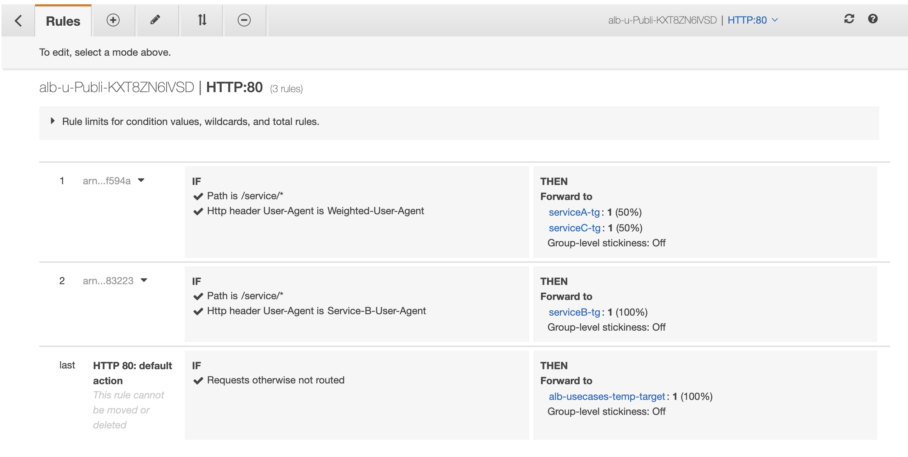

## Weighted Target Groups

Weighted Target Groups in Application Load Balancer enables you to distribute traffic between multiple versions of your application simultaneously. You can associate multiple target groups with a single rule and assign/change weights for each of the target groups to achieve distribution of traffic among these.

